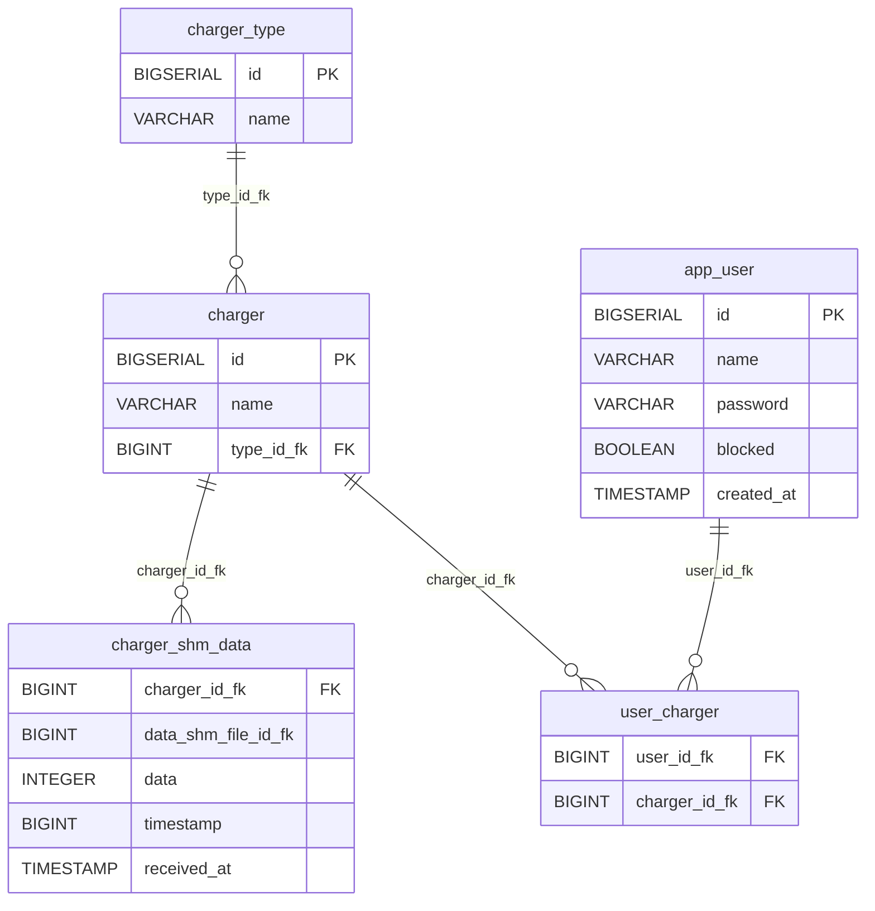

# Database Schema — Charger Monitor

## ER Diagram



---

## Pseudographic Schema

```
┌─────────────────────────┐
│        app_user         │
├─────────────────────────┤
│ PK  id          BIGSERIAL│
│     name        VARCHAR  │
│     password    VARCHAR  │
│     blocked     BOOLEAN  │
│     created_at  TIMESTAMP│
└────────────┬────────────┘
             │ 1
             │
             │ *
┌────────────▼────────────┐          ┌───────────────────────────┐
│      user_charger        │          │          charger           │
├─────────────────────────┤          ├───────────────────────────┤
│ PK,FK  user_id_fk  BIGINT│*───────1│ PK  id          BIGSERIAL │
│ PK,FK  charger_id  BIGINT│          │     name        VARCHAR   │◄─────────┐
└─────────────────────────┘          │ FK  type_id_fk  BIGINT    │          │
                                     └─────────────┬─────────────┘          │
                                                   │ 1                       │ 1
                                                   │                         │
                                                   │ *                       │ *
                                     ┌─────────────▼──────────────────┐  ┌──────────────────────┐
                                     │        charger_shm_data         │  │     charger_type     │
                                     ├─────────────────────────────────┤  ├──────────────────────┤
                                     │ PK,FK  charger_id_fk    BIGINT  │  │ PK  id    BIGSERIAL  │
                                     │ PK     data_shm_file_id  BIGINT │  │     name  VARCHAR    │
                                     │        data              INT    │  └──────────────────────┘
                                     │ PK     timestamp         BIGINT │
                                     │        received_at    TIMESTAMP │
                                     └─────────────────────────────────┘
```

---

## Tables

### `app_user`
Stores application users.

| Column       | Type         | Constraints                  |
|--------------|--------------|------------------------------|
| `id`         | BIGSERIAL    | PRIMARY KEY                  |
| `name`       | VARCHAR(255) | NOT NULL                     |
| `password`   | VARCHAR(255) | NOT NULL                     |
| `blocked`    | BOOLEAN      | NOT NULL, DEFAULT FALSE      |
| `created_at` | TIMESTAMP    | NOT NULL, DEFAULT NOW()      |

---

### `charger_type`
Lookup table for charger types.

| Column | Type         | Constraints |
|--------|--------------|-------------|
| `id`   | BIGSERIAL    | PRIMARY KEY |
| `name` | VARCHAR(255) | NOT NULL    |

---

### `charger`
Represents a physical charger unit.

| Column       | Type         | Constraints                                    |
|--------------|--------------|------------------------------------------------|
| `id`         | BIGSERIAL    | PRIMARY KEY                                    |
| `name`       | VARCHAR(255) | NOT NULL                                       |
| `type_id_fk` | BIGINT       | NOT NULL, FK → `charger_type(id)`              |

---

### `charger_shm_data`
Stores raw SHM (shared memory) data readings received from chargers.

| Column               | Type      | Constraints                                         |
|----------------------|-----------|-----------------------------------------------------|
| `charger_id_fk`      | BIGINT    | NOT NULL, FK → `charger(id)`, part of PK            |
| `data_shm_file_id_fk`| BIGINT    | NOT NULL, part of PK                                |
| `data`               | INTEGER   | NOT NULL                                            |
| `timestamp`          | BIGINT    | NOT NULL, Unix epoch (ms), part of PK               |
| `received_at`        | TIMESTAMP | NOT NULL, DEFAULT NOW()                             |

**Primary Key:** `(charger_id_fk, data_shm_file_id_fk, timestamp)`

---

### `user_charger`
Join table linking users to their assigned chargers (many-to-many).

| Column          | Type   | Constraints                           |
|-----------------|--------|---------------------------------------|
| `user_id_fk`    | BIGINT | NOT NULL, FK → `app_user(id)`, PK     |
| `charger_id_fk` | BIGINT | NOT NULL, FK → `charger(id)`, PK      |

**Primary Key:** `(user_id_fk, charger_id_fk)`

---

## Relationships

| From           | To                  | Type         | Via                              |
|----------------|---------------------|--------------|----------------------------------|
| `charger_type` | `charger`           | one-to-many  | `charger.type_id_fk`             |
| `charger`      | `charger_shm_data`  | one-to-many  | `charger_shm_data.charger_id_fk` |
| `app_user`     | `user_charger`      | one-to-many  | `user_charger.user_id_fk`        |
| `charger`      | `user_charger`      | one-to-many  | `user_charger.charger_id_fk`     |

